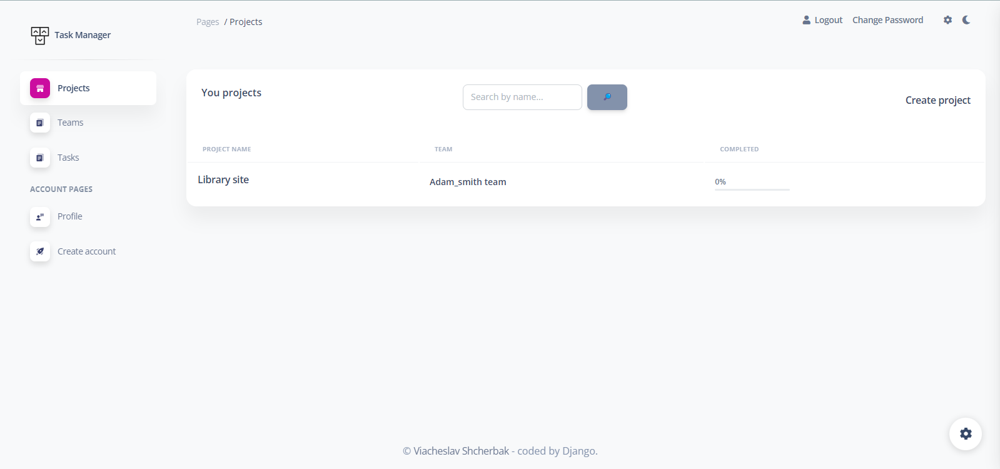
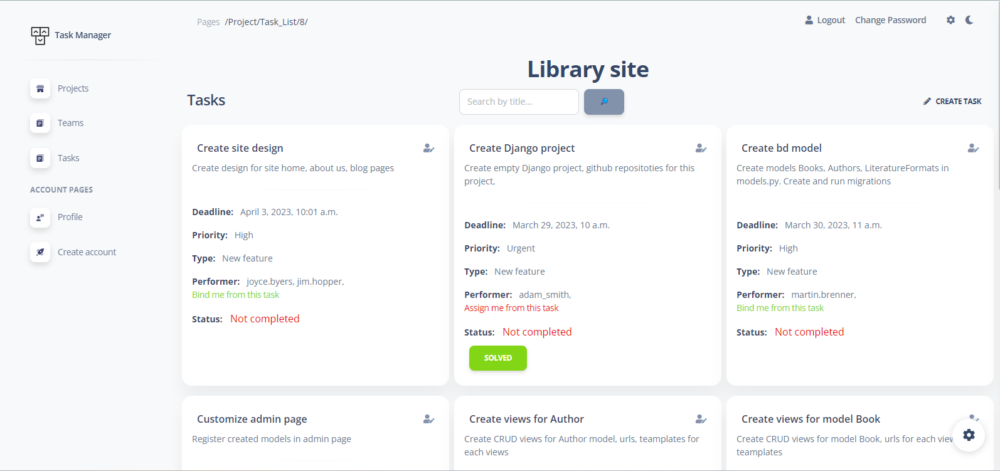

#  IT Company Task Manager

A brief description of your project, what it is used for and how does life get
awesome when someone starts to use it.

#  Check it out!

[Task Manager deploying to Heriku](link_to_project)

## Installation

Python 3 must be already installed

```shell
git clone https://github.com/SlavikSherbak/task-manager.git
python -m venv venv
source venv/bin/activate
pip install -r requirements.txt
python manage.py runserver # starts local Django Server
```


## Features

* Task Creation and Assignment: With this task manager, team members can easily create tasks and assign them to other team members. This helps to ensure that everyone knows what tasks they are responsible for and what tasks they need to complete.

* Project and Team Support: The task manager supports the creation of multiple projects and teams. Different teams can work on different projects, and each team has access to the tasks that are relevant to them. This helps to keep everyone organized and ensures that tasks are completed in a timely manner.

* Task Tracking and Reporting: The task manager allows team members to track the progress of their tasks and provides a clear overview of completed and outstanding tasks. This helps team members to prioritize their work and ensures that deadlines are met.


## Demo

Home page:


Project detail page:

